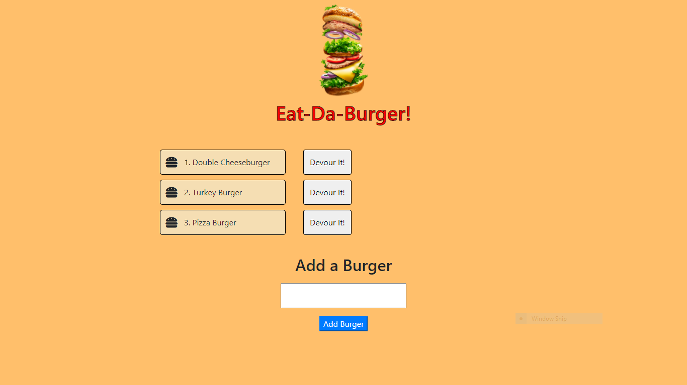
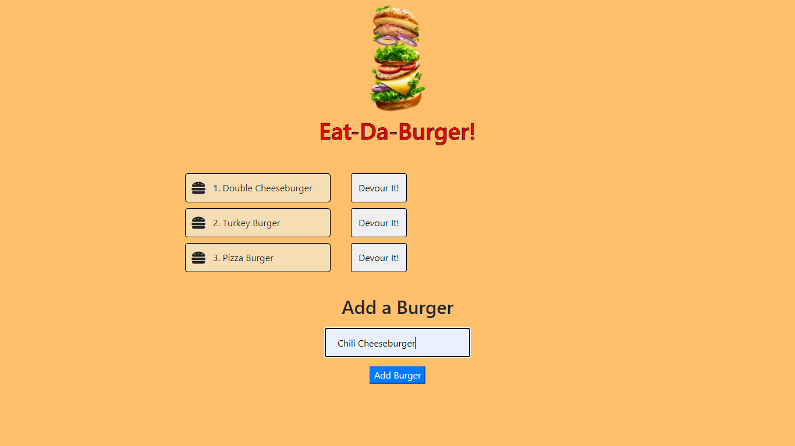
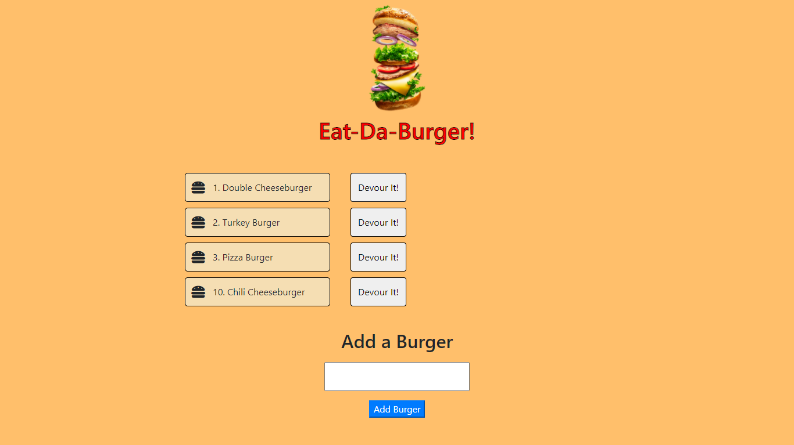
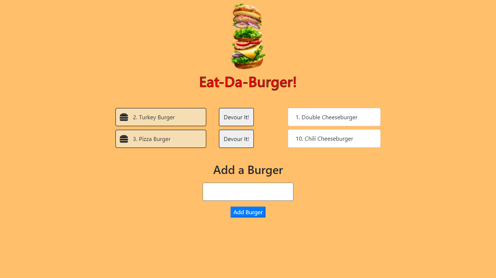

# Eat-Da-Burger

## Table of Contents

1. [Description](#Description)
2. [Languages and Technologies Used](#Languages-and-Technologies-Used)
3. [Installation](#Installation)
4. [Usage](#Usage)
5. [Screencaps](#Screencaps)
6. [Deployed App](#Deployed-App)
6. [Questions](#Questions)
<br/>
<br/>

## Description

This is my new project for which I need to create a README file.
<br/>
<br/>

## Languages and Technologies Used

* HTML
* CSS
* JavaScript
* JQuery
* Node.js
* Express
* Handlebars
* MySQL

This app is a full-stack solution created with Node.js following the MVC (Model View Controller) design pattern. The client side is dynamic HTML content sent back to the client by Express using the Handlebars view engine. The app communicates with a MySQL database using the mysql node package on the server side to retrieve and store the records for the burgers the user can devour virtually.
<br/>
<br/>

## Installation

1. Clone the [repository](https://github.com/BrienBarr/burger) to your PC.
2. Open the local directory to where you cloned the repository in the command line/terminal.
3. Run the npm i command from the command line/terminal.
```
npm i
```
<br/>
<br/>

## Usage

Use the "npm start" or "node server.js" command from the command-line/terminal to start the server connection.
```
npm start
```
OR
```
node server.js
```

Open up a web browser and go to [http://localhost:3036/](http://localhost:3036/) or http://localhost:XXXX where "XXXX" is the port number on which the app is listening.

On the left-hand side of the client page, the user is presented with a number of burgers that are available to virtually devour, which are retrieved from the MySQL database.  To the right of each burger is a button that will devour that burger when clicked.  On the right-hand side of the client page, the user is shown all of the burgers that have been devoured.

At the bottom of the page is a form where the user can type in a name of a burger he/she wishes to add to the list of burgers available to devour.  When the submit button is clicked, the new burger is added to the MySQL database and appears as a burger available to devour.

<br/>
<br/>

## Screencaps

<br/>
The start of the app<br/><br/>



<br/>
Add a new burger<br/><br/>



<br/>
New burger added<br/><br/>



<br/>
Burgers devoured<br/><br/>



<br/>
<br/>

## Deployed App

See the deployed app in action on Heroku [here](https://damp-lowlands-96896.herokuapp.com/)!

<br/>
<br/>

## Questions

[GitHub/BrienBarr](https://github.com/BrienBarr)<br/>
For additional questions, e-mail me at: [brien.barr3320@gmail.com](brien.barr3320@gmail.com)